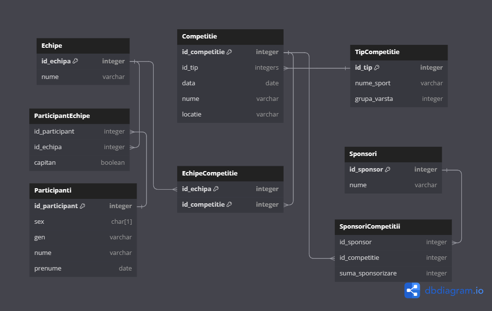

# Proiect Baze de date - Marinache Andrei-Alexandru - 333AB

>RO: Aplicație pentru evidența informațiilor legate de organizarea de competiții sportive.  
>EN: App for managing information about planning sport tournaments.  

## RO

Mică aplicație cu interfață grafică in Python, utilizâns PyQt6 si QtDesigner. Pentru baza de date am folosit Sqlite, modul integrat în Python. Poți efectua operații de Add, Update și Delete pentru tipurile de competiții și participanți (pentru moment). Am folosit Material icons și o poză cu Lain din anime-ul "Serial experiments Lain" pentru că mi se părea destul de plictisitoare aplicația. Structura bazei de date este următoarea:

## EN

Small app I made using Python, PyQt6, QtDesigner and Sqlite to manage sports tournaments. Can add, update, delete tournament types and participants (for now). Planning to add add, update and delete options for other tables as well. Uses Material icons and a Lain picture from the anime "Serial experiments Lain" because I think it was too boring.The database structure is as follows:

